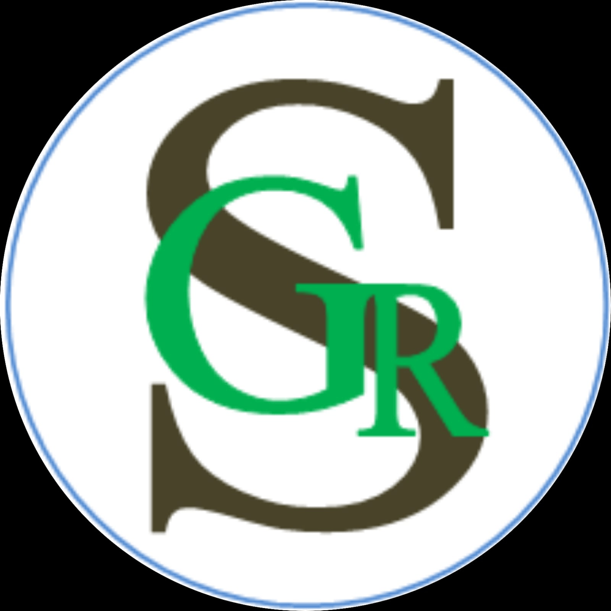

<div align="center">
  
  
  # GRS App
  
  *A beautifully crafted Flutter application.*
  
  [](https://flutter.dev)
  [](https://dart.dev)
</div>

---

## 📖 About The Project

**GRS App** is a feature-rich Flutter application designed to provide an exceptional user experience. *(Replace this text with a short, engaging description of what your app specifically does, who it is for, and the problem it solves).*

### ✨ Features
- 🚀 **Fast & Responsive:** Built with Flutter for smooth performance on Android and iOS.
- 🎨 **Beautiful UI:** Modern, clean, and intuitive user interface.
- 🔐 **Secure:** Incorporates best practices for data handling and security.
- 🌐 **Cross-Platform:** A single unified codebase for multiple platforms.

---

## 📸 Screenshots

<div align="center">
  
  &nbsp;&nbsp;&nbsp;&nbsp;
  
  &nbsp;&nbsp;&nbsp;&nbsp;
  
</div>

> **Note to Developer:** *To update these screenshots, take screenshots of your app, place them inside an `assets/screenshots/` folder, and update the `img src` paths in this README file.*

---

## 🚀 Getting Started

Follow these instructions to get a copy of the project up and running on your local machine for development and testing purposes.

### Prerequisites

Before you begin, ensure you have met the following requirements:
*   **Flutter SDK**: [Install Flutter](https://docs.flutter.dev/get-started/install) 
*   **Dart SDK**: Included with Flutter.
*   **IDE**: [Android Studio](https://developer.android.com/studio) or [VS Code](https://code.visualstudio.com/) with Flutter/Dart plugins installed.
*   **Git**: [Install Git](https://git-scm.com/)

### Installation

1. **Clone the repository**
   ```bash
   git clone https://github.com/YourUsername/GRS_app.git
   ```

2. **Navigate to the project directory**
   ```bash
   cd GRS_app
   ```

3. **Install dependencies**
   ```bash
   flutter pub get
   ```

4. **Run the app**
   Connect your device or start an emulator, then run:
   ```bash
   flutter run
   ```

---

## 📁 Project Structure

Here is a brief overview of the project's folder structure:

```text
GRS_app/
├── android/        # Android-specific configuration and build files
├── assets/         # Static assets like images, fonts, and icons
│   └── icon/       # Contains app_logo.png
├── ios/            # iOS-specific configuration and build files
├── lib/            # Main source code of the application
│   ├── main.dart   # Application entry point
│   └── ...         # Application screens, widgets, and business logic
├── pubspec.yaml    # Flutter project configuration and dependencies
└── README.md       # Project documentation
```

---

## 🛠️ Built With

* [Flutter](https://flutter.dev/) - UI Toolkit for building natively compiled applications.
* [Dart](https://dart.dev/) - Client-optimized programming language.

---

## 🤝 Contributing

Contributions are what make the open-source community such an amazing place to learn, inspire, and create. Any contributions you make are **greatly appreciated**.

1. Fork the Project
2. Create your Feature Branch (`git checkout -b feature/AmazingFeature`)
3. Commit your Changes (`git commit -m 'Add some AmazingFeature'`)
4. Push to the Branch (`git push origin feature/AmazingFeature`)
5. Open a Pull Request

---

## 📄 License

Distributed under the MIT License. See `LICENSE` for more information.
